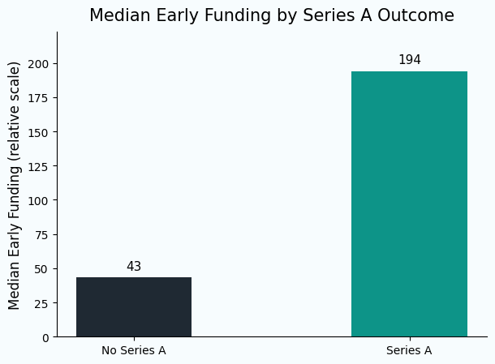

# Early Predictors of Startup Growth

## Project Summary
The rapid expansion of the global startup ecosystem has made early-stage evaluation increasingly important, yet highly uncertain. While many startups secure initial funding only a small fraction successfully progress to major milestones such as Series A. This creates a challenge for investors, operators, and analysts attempting to identify high-potential ventures at an early stage. This project investigates whether observable early-stage characteristics can provide meaningful signals of future startup growth. By analyzing funding behavior, investor participation, and foundational startup attributes, the goal is to identify patterns that distinguish startups that successfully scale from those that do not. 

---

## Research Question
Which early-stage characteristics are associated with startup progression to a Series A funding round?

---

## Data Preparation and Methodology

This project uses two datasets: 
- Startup Profile Dataset
- Funding Events Dataset

Since the data came from different sources, startup names were first standardized to make sure they matched correctly before merging. 

After merging the datasets, basic cleaning was done to handle missing values and remove unnecessary columns. Some text fields also needed formatting to make them easier to work with. New variables were then created to capture early-stage activity, such as funding levels and investor participation. These were used to compare startups that reached Series A with those that did not.

The analysis mainly focuses on simple comparisons and visualizations to identify patterns in the data, rather than building complex models. This helps keep the results easy to interpret and directly tied to the original question.

---

## Key Findings

The analysis shows a clear difference in early-stage funding between startups that reached Series A and those that did not. Startups that progressed to Series A generally raised more funding early on and had higher investor participation. This suggests that early external validation — especially through funding and investor interest — may be more important than internal factors like team size, at least in this dataset.

From this, it seems that startups that gain financial traction early are more likely to build the momentum needed to reach later funding stages.

---

## Sample Visualization



---

## Project Structure

```
early_predictors_startup_growth/
├── data/
│ ├── Investors_DS1.csv
│ ├── Startups_funding_DS2.csv
│ └── startup_master_dataset.csv
│
├── notebooks/
│ └── early_predictors_startup_growth.ipynb
│
├── images/
│ └── median_funding_seriesA_final.png
│
├── README.md
├── requirements.txt
└── .gitignore
```

---

## Tools Used
- Python - used for data processing and analysis 
- pandas - used for data cleaning, transformation, and merging datasets
- matplotlib / seaborn - used for generating visual insights
- Jupyter Notebook - used for structuring and documenting the analytical workflow

---

## Limitations

This analysis is based on a relatively small and incomplete dataset, so the results should be interpreted with caution. Not all startups have fully recorded funding histories, which may affect the accuracy of the comparisons. The number of startups that reached Series A is also limited, making the dataset somewhat imbalanced. In addition, some variables are simplified representations of more complex real-world factors.

Finally, geographic information was not consistently available, so regional effects could not be explored in this analysis. 
